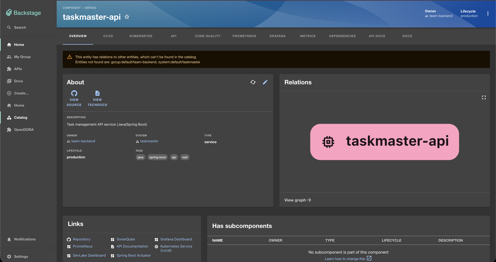
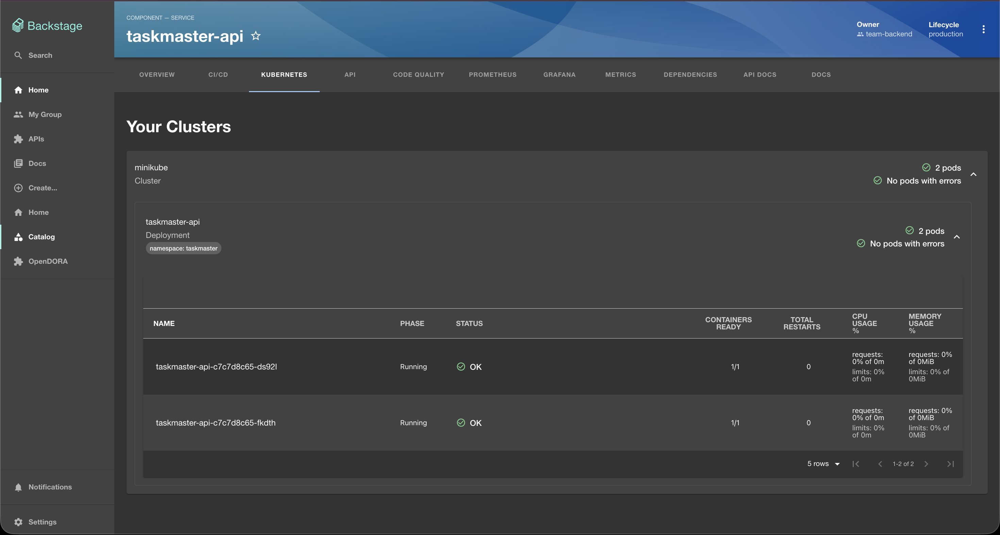
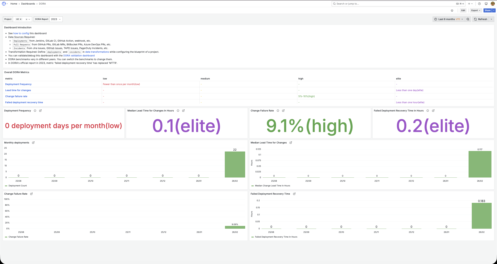
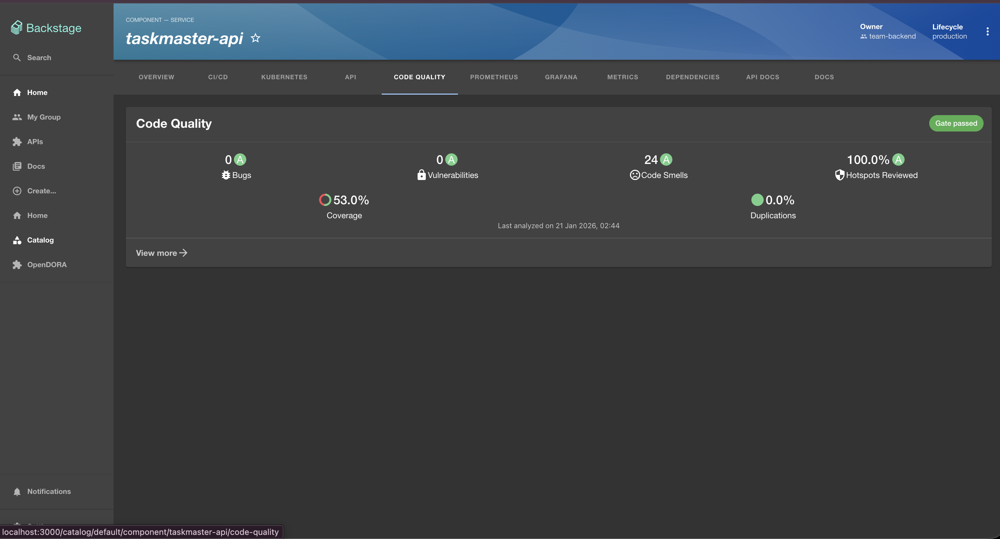
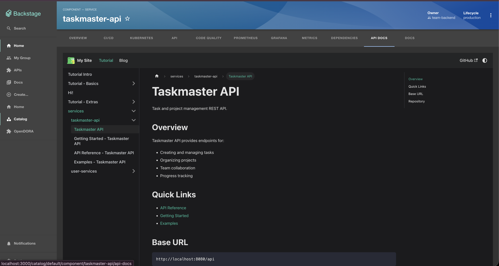
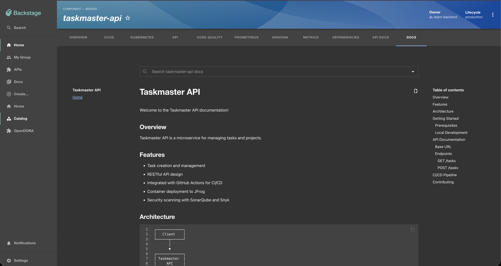
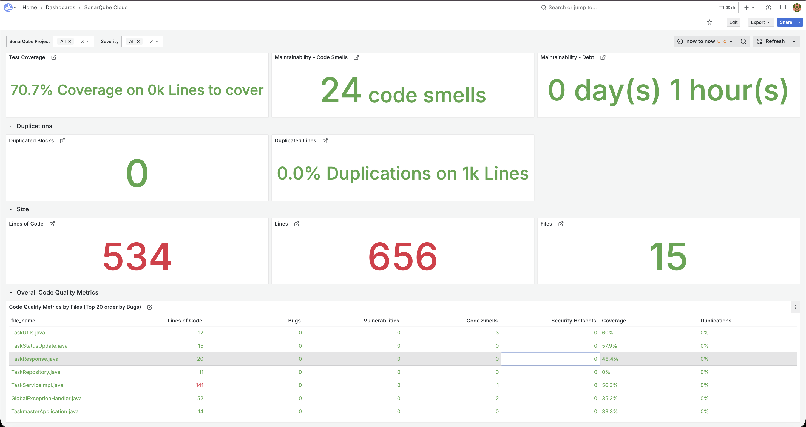

# Taskmaster Developer Portal

A complete Backstage developer portal with DORA metrics, API documentation, code quality tracking, and Kubernetes visibility.

## What's Inside

- **📊 DORA Metrics** - Track deployments, lead time, and reliability (via DevLake + Grafana)
- **☸️ Kubernetes Dashboard** - Real-time pod status, logs, and deployments
- **📚 Auto-Generated Docs** - TechDocs from markdown, API docs via Docusaurus
- **🔍 Code Quality** - SonarQube metrics embedded in each service
- **🚀 CI/CD Status** - GitHub Actions workflow visibility
- **📦 Service Catalog** - Discover all services, owners, and dependencies


## Quick Start

### Prerequisites

- Node.js 18+
- Docker Desktop
- kubectl + minikube (for Kubernetes)
- GitHub account with admin access

### 1. Environment Setup

Copy `.env.example` to `.env` and fill in your values:

```bash
cp .env.example .env
```

Required variables:
```bash
# GitHub OAuth
GITHUB_CLIENT_ID=your_github_client_id
GITHUB_CLIENT_SECRET=your_github_client_secret

# SonarQube
SONARQUBE_TOKEN=your_sonarcloud_token

# Kubernetes
K8S_CLUSTER_URL=https://127.0.0.1:55001  # from: kubectl cluster-info
K8S_SERVICE_ACCOUNT_TOKEN=your_token     # from: kubectl create token
```

### 2. Start Monitoring Stack (DevLake + Grafana)

```bash
cd devlake-stack
docker-compose up -d

# Access DevLake UI to configure
open http://localhost:4000
```

**Configure DevLake:**
1. Add GitHub connection with Personal Access Token (needs `repo`, `workflow`, `read:org` scopes)
2. Create project and add your repositories
3. Set deployment pattern: `(?i)(deploy|jfrog)` to match your workflows
4. Run data collection

### 3. Start Backstage

```bash
# Install dependencies
yarn install

# Start dev server
yarn start
```

Access at `http://localhost:3000`

### 4. Start Kubernetes (Optional)

```bash
# Start local cluster
minikube start --cpus=4 --memory=8192

# Deploy sample app
kubectl apply -f k8s/

# Get service account token for Backstage
kubectl create token default -n default
# Copy token to .env file
```

## Architecture

```
GitHub Repos
    ├── Code + PRs
    ├── GitHub Actions (CI/CD)
    └── catalog-info.yaml (service metadata)
           │
           ├──────────────┬──────────────┬─────────────┐
           ▼              ▼              ▼             ▼
      DevLake      Kubernetes      SonarCloud    Docusaurus
           │              │              │             │
           ▼              │              │             │
      MySQL DB           │              │             │
           │              │              │             │
           └──────────────┴──────────────┴─────────────┘
                          │
                          ▼
                    Backstage Portal
                  (http://localhost:3000)
                          │
                ┌─────────┴──────────┐
                ▼                    ▼
            Grafana              Service Catalog
         (DORA Metrics)        + Kubernetes Tab
```

## Port Reference

| Port | Service | Access |
|------|---------|--------|
| 3000 | Backstage | Main developer portal |
| 3002 | Docusaurus | API documentation site |
| 3004 | Grafana | DORA metrics dashboards |
| 4000 | DevLake Config UI | Data collection management |
| 7007 | Backstage Backend | API server |
| 9090 | Prometheus | Metrics (for system monitoring) |

## Key Integrations

### 1. Service Catalog

Every service has a `catalog-info.yaml` in its repo:

```yaml
apiVersion: backstage.io/v1alpha1
kind: Component
metadata:
  name: taskmaster-api
  description: Task management REST API
  annotations:
    # GitHub integration
    github.com/project-slug: your-username/taskmaster-api
    
    # Documentation
    backstage.io/techdocs-ref: dir:.
    docusaurus.io/docs-path: '/docs/services/taskmaster-api/overview'
    
    # Code quality
    sonarqube.org/project-key: your-username_taskmaster-api
    
    # DORA metrics
    devlake.apache.org/project: Taskmaster
    
    # Kubernetes
    backstage.io/kubernetes-id: taskmaster-api
    backstage.io/kubernetes-namespace: default
    
  links:
    - url: https://github.com/your-username/taskmaster-api
      title: Repository
    - url: http://localhost:3004/d/qNo8_0M4z/dora
      title: DORA Metrics
      
spec:
  type: service
  lifecycle: production
  owner: team-backend
  system: taskmaster
```

**Register a service:**
1. Go to Backstage → "Create..." → "Register Existing Component"
2. Enter your `catalog-info.yaml` URL
3. Click Import

### 2. TechDocs (Auto-Generated Documentation)

Add to your service repo:

```
your-repo/
├── catalog-info.yaml
├── mkdocs.yml          # Doc configuration
└── docs/
    └── index.md        # Your documentation
```

Example `mkdocs.yml`:
```yaml
site_name: 'Taskmaster API'
nav:
  - Home: index.md
  - API Reference: api.md
  - Architecture: architecture.md
plugins:
  - techdocs-core
```

Docs auto-generate and appear in the "Docs" tab!

### 3. DORA Metrics (DevLake)

**What you get:**
- **Deployment Frequency** - How often you deploy (Elite: multiple times/day)
- **Lead Time for Changes** - Commit to production time (Elite: < 1 day)
- **Change Failure Rate** - % of failed deployments (Elite: < 15%)
- **MTTR** - Recovery time from failures (Elite: < 1 hour)

**How it works:**
1. DevLake collects data from GitHub (commits, PRs, workflow runs)
2. Deployment pattern matches workflow names (e.g., "Build & Deploy to JFrog")
3. Metrics calculated and stored in MySQL
4. Displayed in Grafana dashboards
5. Linked from Backstage service pages

**Access:** http://localhost:3004 (admin/admin) or via service links

### 4. Kubernetes Integration

**What you see:**
- Real-time pod status and health
- Container logs
- Resource usage (CPU, memory)
- Deployment history
- Error alerts

**Configuration in `app-config.yaml`:**
```yaml
kubernetes:
  serviceLocatorMethod:
    type: 'multiTenant'
  clusterLocatorMethods:
    - type: 'config'
      clusters:
        - name: minikube
          url: ${K8S_CLUSTER_URL}
          authProvider: 'serviceAccount'
          serviceAccountToken: ${K8S_SERVICE_ACCOUNT_TOKEN}
```

**Label your Kubernetes deployments:**
```yaml
# k8s/deployment.yaml
metadata:
  labels:
    backstage.io/kubernetes-id: taskmaster-api
spec:
  template:
    metadata:
      labels:
        backstage.io/kubernetes-id: taskmaster-api
```

### 5. Code Quality (SonarQube)

**Setup:**
1. Create project on SonarCloud.io
2. Get your token from Account → Security
3. Add token to `.env`
4. Add annotation to `catalog-info.yaml`

**View:** Code Quality tab shows coverage, bugs, vulnerabilities, code smells

### 6. API Documentation (Docusaurus)

Separate documentation site at `http://localhost:3002` with:
- API reference for all services
- Code examples
- Authentication guides
- Getting started tutorials

**Embedded in Backstage** via iframe in "API Docs" tab.

## Adding a New Service

1. **Create `catalog-info.yaml`** in your repo (see example above)
2. **Add docs** (optional):
   ```bash
   mkdir docs
   echo "# My Service" > docs/index.md
   ```
3. **Create `mkdocs.yml`** (optional)
4. **Register in Backstage**: Create... → Register Existing Component → Enter URL
5. **Deploy to Kubernetes** (optional): Add labels to match `backstage.io/kubernetes-id`

Done! Service appears in catalog with all integrations.

## Troubleshooting

### DORA Metrics Show "N/A"

**Issue:** No deployments detected

**Fix:**
1. Check DevLake collected data: http://localhost:4000 → Projects → Status
2. Verify deployment pattern matches your workflow name
   - Pattern: `(?i)(deploy|jfrog)`
   - Your workflow: "Build & Deploy to JFrog" ✅
3. Ensure `environment` is set to `PRODUCTION` in `cicd_tasks` table
4. Set correct time range in Grafana (your data is from Feb 2026, not 2023!)

### Kubernetes Tab Shows 404

**Issue:** Backend plugin not loaded

**Fix:**
```typescript
// packages/backend/src/index.ts
backend.add(import('@backstage/plugin-kubernetes-backend'));
```

Restart Backstage.

### Pods Not Showing

**Issue:** Labels don't match

**Fix:** Ensure deployment has label:
```yaml
metadata:
  labels:
    backstage.io/kubernetes-id: your-service-name
```

Match this with annotation in `catalog-info.yaml`.

### TechDocs Not Generating

**Checklist:**
- ✅ `mkdocs.yml` exists in repo root
- ✅ `docs/index.md` exists
- ✅ Annotation `backstage.io/techdocs-ref: dir:.` is set
- ✅ Wait 5-10 minutes for initial generation

### SonarQube Not Loading

**Checklist:**
- ✅ `SONARQUBE_TOKEN` in `.env`
- ✅ Project key matches SonarCloud project exactly
- ✅ Backend plugin added to `index.ts`
- ✅ SonarCloud has scanned the repository

## Configuration Files

### `.env` (Create from .env.example)
Environment variables for GitHub OAuth, SonarQube, Kubernetes

### `app-config.yaml`
Main Backstage configuration - integrations, plugins, auth

### `catalog-info.yaml` (in each service repo)
Service metadata, annotations, links

### `mkdocs.yml` (in each service repo)
Documentation configuration for TechDocs

### `docker-compose.yml` (in devlake-stack/)
DevLake, MySQL, Grafana services

## Useful Commands

```bash
# Backstage
yarn start.                 # Start dev server
yarn build                  # Build for production
yarn tsc                    # Type check

# Kubernetes
minikube start              # Start local cluster
kubectl get pods            # List pods
kubectl logs <pod>          # View logs
kubectl create token        # Get SA token for Backstage

# DevLake
docker-compose up -d        # Start stack
docker-compose logs -f      # View logs
docker-compose down         # Stop stack

# Docusaurus (in separate repo)
npm start                   # Start docs site on port 3002
```

## Project Structure

```
my-backstage-app/
├── .env                          # Environment variables (create from .env.example)
├── .env.example                  # Template with required variables
├── app-config.yaml               # Main Backstage config
├── catalog-info.yaml             # This repo's service definition
├── screenshots/                  # Integration screenshots
├── packages/
│   ├── app/                      # Frontend
│   │   └── src/components/
│   │       ├── catalog/EntityPage.tsx  # Custom service tabs
│   │       └── docusaurus/             # Docusaurus embed component
│   └── backend/                  # Backend API
│       └── src/index.ts          # Plugin registration
├── devlake-stack/
│   ├── docker-compose.yml        # DevLake + Grafana
│   └── .env                      # DevLake configuration
├── k8s/                          # Kubernetes manifests
│   ├── namespace.yaml
│   ├── deployment.yaml
│   └── service.yaml
└── README.md                     # This file
```

## What Each Tab Does

When you open a service in Backstage, you see:

| Tab | What It Shows | Source |
|-----|---------------|--------|
| **Overview** | Metadata, owner, links | catalog-info.yaml |
| **CI/CD** | GitHub Actions status | GitHub API |
| **Kubernetes** | Pods, deployments, logs | K8s cluster |
| **DORA** | Deployment metrics | DevLake (optional) |
| **Code Quality** | Coverage, bugs, debt | SonarQube |
| **API Docs** | API reference | Docusaurus |
| **Docs** | Auto-generated docs | TechDocs (mkdocs) |
| **Dependencies** | Service relationships | Catalog graph |


## Screenshots

### Service Catalog

*All your services with metadata, owners, and links*

### Kubernetes Integration

*Real-time pod status, logs, and resource usage*

### DORA Metrics

*Track deployment frequency, lead time, change failure rate, and MTTR*

### Code Quality (SonarQube)

*Coverage, bugs, vulnerabilities, and technical debt*

### API Documentation

*Comprehensive API reference embedded in Backstage*

### TechDocs

*Auto-generated docs from markdown files*

### Devlake

*sonarqube metrics on devlake


## Resources

- **Backstage Docs**: https://backstage.io/docs
- **DevLake Docs**: https://devlake.apache.org/docs
- **DORA Research**: https://dora.dev
- **Kubernetes Plugin**: https://backstage.io/docs/features/kubernetes
- **TechDocs Guide**: https://backstage.io/docs/features/techdocs


**Questions?** Open an issue or reach out in #platform-support.

---

**Happy coding!** 🚀

*Last Updated: February 2026*
